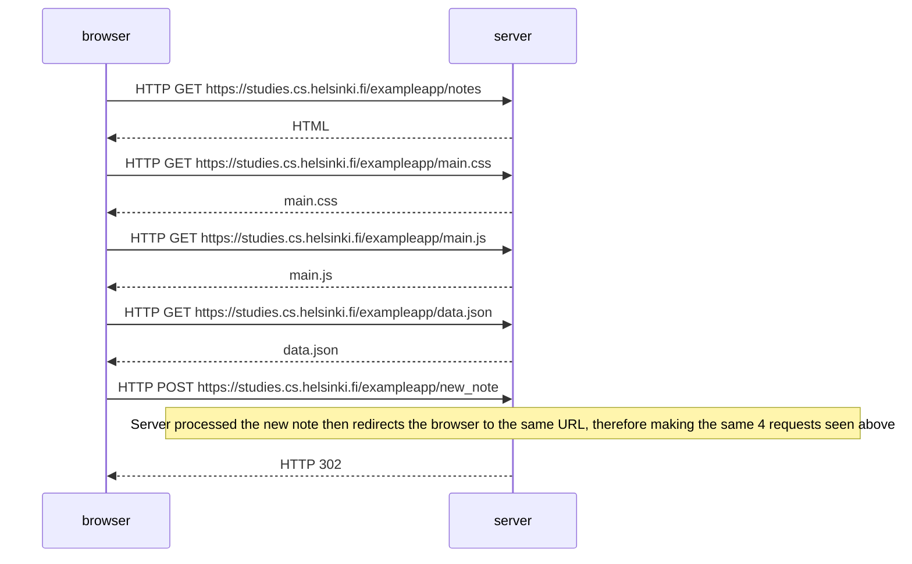

```mermaid
sequenceDiagram
    participant b as browser
    participant s as server
    b->>s: HTTP GET https://studies.cs.helsinki.fi/exampleapp/notes
    s-->>b: HTML
    b->>s: HTTP GET https://studies.cs.helsinki.fi/exampleapp/main.css
    s-->>b: main.css
    b->>s: HTTP GET https://studies.cs.helsinki.fi/exampleapp/main.js
    s-->>b: main.js
    b->>s: HTTP GET https://studies.cs.helsinki.fi/exampleapp/data.json
    s-->>b: data.json
    b->>s: HTTP POST https://studies.cs.helsinki.fi/exampleapp/new_note
    note over s: Server processed the new note then redirects the browser to the same URL, therefore making the same 4 requests seen above
    s-->>b: HTTP 302
```