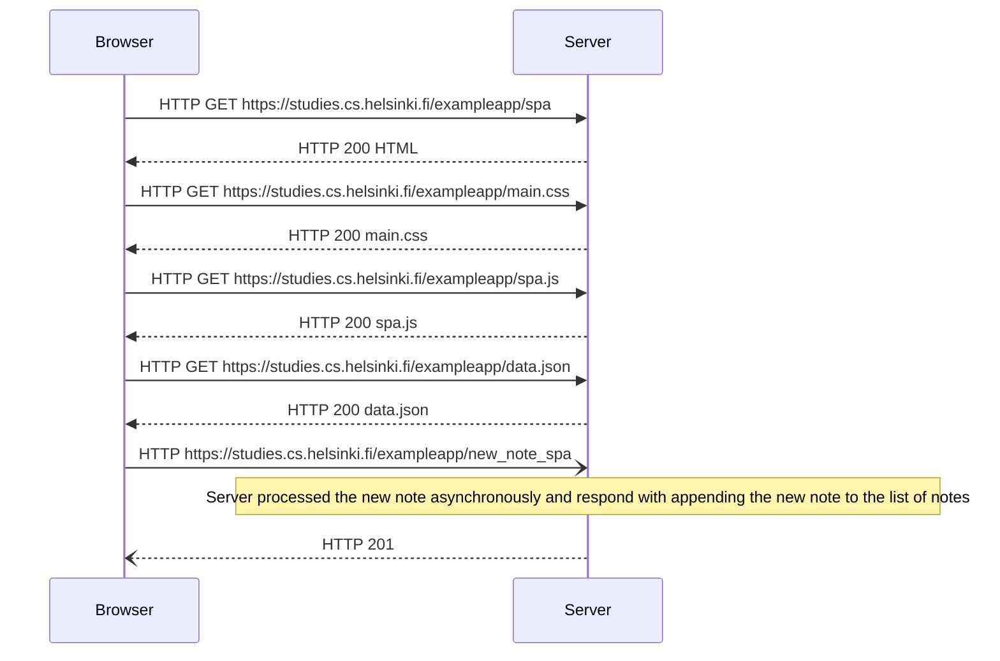

```mermaid
sequenceDiagram
    participant b as Browser
    participant s as Server
    b->>s: HTTP GET https://studies.cs.helsinki.fi/exampleapp/spa
    s-->>b: HTTP 200 HTML
    b->>s: HTTP GET https://studies.cs.helsinki.fi/exampleapp/main.css
    s-->>b: HTTP 200 main.css
    b->>s: HTTP GET https://studies.cs.helsinki.fi/exampleapp/spa.js
    s-->>b: HTTP 200 spa.js
    b->>s: HTTP GET https://studies.cs.helsinki.fi/exampleapp/data.json
    s-->>b: HTTP 200 data.json
    b-)s: HTTP https://studies.cs.helsinki.fi/exampleapp/new_note_spa
    note over s: Server processed the new note asynchronously and respond with appending the new note to the list of notes
    s--)b: HTTP 201
```