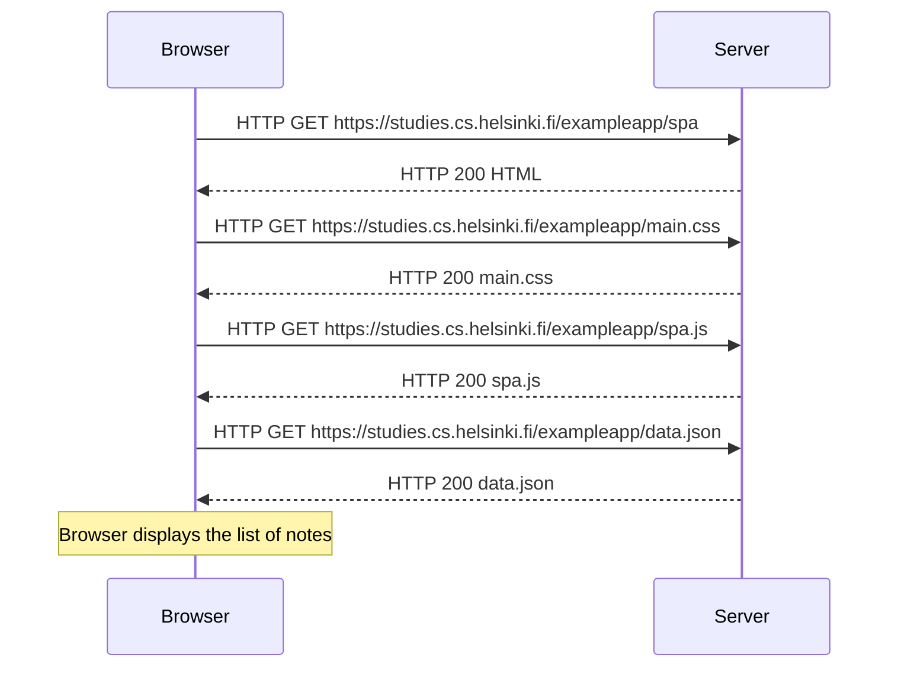

```mermaid
sequenceDiagram
    participant b as Browser
    participant s as Server
    b->>s: HTTP GET https://studies.cs.helsinki.fi/exampleapp/spa
    s-->>b: HTTP 200 HTML
    b->>s: HTTP GET https://studies.cs.helsinki.fi/exampleapp/main.css
    s-->>b: HTTP 200 main.css
    b->>s: HTTP GET https://studies.cs.helsinki.fi/exampleapp/spa.js
    s-->>b: HTTP 200 spa.js
    b->>s: HTTP GET https://studies.cs.helsinki.fi/exampleapp/data.json
    s-->>b: HTTP 200 data.json
    note over b: Browser displays the list of notes
```